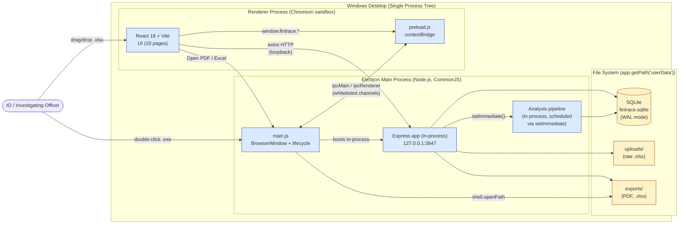
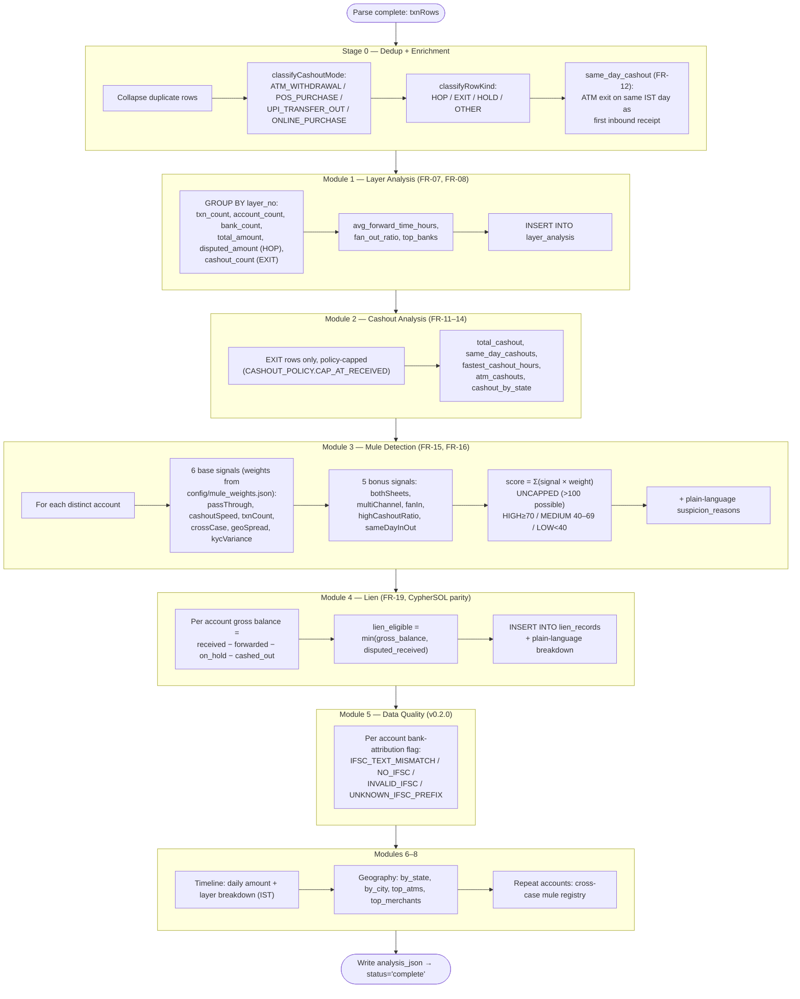
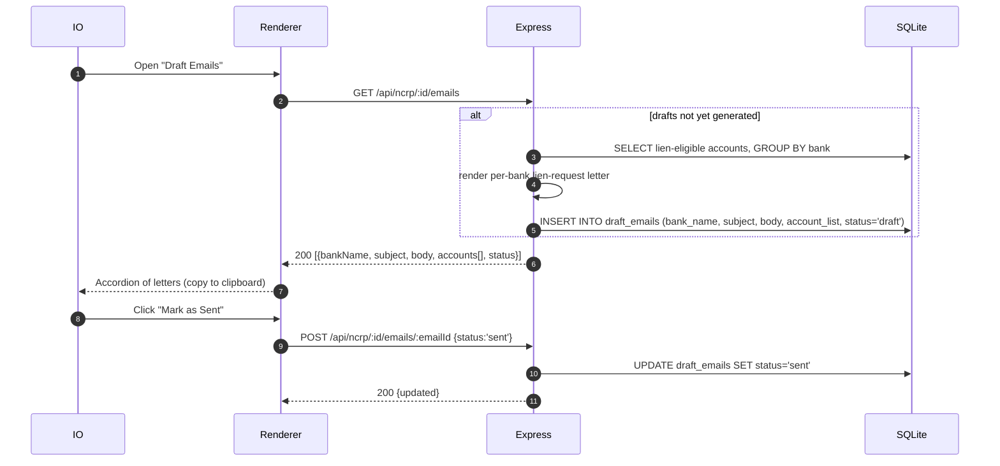

# System Design Document (SDD)
## FinTrace NCRP — Cyber Crime Financial Trail Analyzer

| Field | Value |
|---|---|
| Document ID | FINTRACE-SDD-001 |
| Version | 2.1 (as-built) |
| Status | Updated — reflects code through v0.3.0 |
| Date | 2026-06-18 |
| Owner | Architecture / Engineering |
| Related | FINTRACE-SRS-001 (v1.0) |
| Audience | Engineering, QA, Tech Leads |

> **As-built note (v2.1):** This revision reconciles the original forward design (v1.0, 2026-05-26) with the code that actually shipped through **v0.3.0**. Where the implementation diverged from the design, this document describes **what is built**, and flags any remaining aspirational items inline with **🔭 Planned**. Most of the v2.0 "🔭 Planned" items have since shipped (visual PDF charts + annexure split, the v0.3.0 version bump). The biggest deltas from v1.0:
> - **Language is JavaScript (CommonJS), not TypeScript.** Backend files are `.js`; frontend is React `.jsx`. There is no `tsconfig`/`.ts` layer.
> - **Analysis runs in-process** on the Express side via `setImmediate(...)` after the upload returns `202` — there is **no separate worker thread**. `better-sqlite3` is synchronous, so the pipeline is plain synchronous JS scheduled off the request.
> - **Express is embedded in the Electron main process** (same process, not a spawned subprocess).
> - **7 SQLite tables** ship (see §3); the v1.0 `accounts`, `quarantined_rows`, `settings`, `banks`, `findings`, `lien_status_history` tables were not built. Lien uses the **CypherSOL gross-balance formula**; mule scoring uses **11 signals and is uncapped**.
> - **Frontend has 10 pages** (not 21), uses **HashRouter + React Context** (not BrowserRouter + Zustand), and includes a **Data Quality** page.
> - **Outputs:** a **19-sheet Excel workbook** and a **visual PDF dossier** (charts rasterised SVG→PNG + Annexure A–H), plus per-bank lien-request letters. In packaged builds every export routes through a **native OS "Save As" dialog** (preload `showSaveDialog`/`saveExportAs`).
> - **v0.3.0 features now built:** visual PDF dossier with rasterised charts; **evidentiary provenance** (source-file SHA-256 → case record + audit log + PDF + changed-source warning, `lib/provenance.js`); **self-healing fuzzy parser** (`parsers/parseFuzzy.js`, a 3rd resolution tier behind exact + loose); **suspected-duplicate flagging** (non-destructive, with raw/deduped reconciliation); **Old Transaction** exclusion (>6 months, preserved separately); and supplementary analyses (`analysis/{hopGraph,cycleDetector,connectivity,dayOfWeek}.js`).
> - **Version:** all three `package.json` files now read **0.3.0** (the v0.1.0/v0.2.0 version lag is resolved).

> **Design override note:** Although `FR-01` in the SRS quotes 250 MB as the rejection threshold, this SDD treats **50 MB as the enforced upload size limit** at every system boundary (drag-drop validator, multipart parser, IPC bridge, Express middleware). This is the binding constraint for implementation.

---

## 1. Component Architecture

FinTrace NCRP is a single-binary Electron 33 application. The Express backend is **embedded in the Electron main process** (not spawned), and all inter-component traffic stays on the local loopback interface (`127.0.0.1`).

### 1.1 High-Level Component Diagram (Mermaid)



### 1.2 Component Responsibilities

| Component | Responsibility | Why this boundary |
|---|---|---|
| **Electron Main (`electron/main.js`)** | App lifecycle, window creation, native dialogs, IPC handlers, and **booting the Express app in-process**. | Only the main process has full Node privileges; UI sandbox must not. |
| **Renderer (React/Vite)** | Presentation, charts, tables, user input. No filesystem, no Node APIs. | Hardened with `contextIsolation: true`, `nodeIntegration: false`, `sandbox: true`. |
| **Preload (`electron/preload.js`)** | Narrow typed IPC surface (`window.fintrace.getVersion/openPdf/openFile/openExportsFolder/savePdfCopy/showSaveDialog/saveExportAs`). Whitelisted channels only (double-checked on the main side). | Bridges renderer ↔ main without leaking `ipcRenderer` itself. `showSaveDialog` + `saveExportAs` back the native "Save As" export flow. |
| **Express app (`backend/src/server.js` + `routes/ncrp.js`)** | REST API. Owns business logic: parsing, analysis, lien math, PDF/Excel/email generation. Bound to `127.0.0.1:3847`. | Renderer talks to it over `axios` exactly as if it were a remote API — keeps logic testable in isolation (Jest + supertest). |
| **Analysis pipeline (`analyzers/analyzer.js` + `analysis/*`)** | CPU-bound work: a fault-isolated multi-module forensic analysis on the parsed ledger (layers, cashout, mule, lien, data-quality, money-flow/circular/connectivity, timeline, geography, recovery, roadmap, repeats). Invoked **in-process via `setImmediate`** after the upload responds `202`. | `better-sqlite3` is synchronous; deferring with `setImmediate` keeps the upload response non-blocking without the complexity of a worker thread. |
| **SQLite (better-sqlite3)** | All durable case state (WAL mode, `synchronous=NORMAL`, `foreign_keys=ON`, `cache_size=-10000`). | Single-file, zero-admin, transactionally safe. |
| **File System** | Raw uploads (kept for re-parse / audit) and generated exports (PDF, `.xlsx`). | All under `app.getPath('userData')` — per-user, not world-readable. |

---

## 2. Data Flow Diagrams

### 2.1 File Upload Flow (drag-drop → DB insert → analysis trigger)

Highlights the **3-stage upload validation** (size → magic bytes → NCRP content tokens), the **50 MB enforced limit**, **evidentiary provenance** (a SHA-256 of the raw file is computed before parsing and recorded on the case record + audit log; a changed-source warning fires on re-ingest), and **row deduplication** (the parser collapses identical rows across sheets and returns warnings; there is no separate quarantine table). Header/sheet resolution is a **3-tier resolver** — exact → loose (normalized synonyms) → **self-healing fuzzy** (max Dice/Levenshtein ≥ 85%, `parsers/parseFuzzy.js`); the happy path is byte-identical and any fuzzy resolution is surfaced as a `parse_warning`. Transactions older than 6 months are split off as **Old Transactions** (excluded from all figures, preserved for reference).

```mermaid
sequenceDiagram
    autonumber
    participant U as IO (User)
    participant R as Renderer (React)
    participant P as Preload (contextBridge)
    participant E as Express :3847
    participant A as Analysis (setImmediate)
    participant FS as FS (userData)
    participant DB as SQLite

    U->>R: Drag .xlsx onto drop zone
    R->>R: Client-side guard<br/>type ∈ {.xlsx,.xls} ∧ size ≤ 50 MB
    alt size > 50 MB OR wrong type
        R-->>U: Inline error<br/>("File exceeds 50 MB limit")
    else valid
        R->>E: POST /api/ncrp/upload (multipart, max=50 MB)
        E->>E: multer size cap ≤ 50 MB
        E->>E: Magic-byte check (Excel signature)
        E->>E: Content scan (NCRP header tokens present?)
        E->>FS: persist file → uploads/
        E->>DB: INSERT INTO ncrp_reports<br/>(filename, analysis_status='pending')
        E->>E: parseNcrpFile() → {rows, warnings}<br/>(multi-sheet, header auto-detect FR-02,<br/>dedup, IFSC resolution)
        E->>DB: batch INSERT INTO ncrp_transactions
        E-->>R: 202 Accepted {reportId, status:'pending'}
        E->>A: setImmediate(runAnalysisInBackground)
        R->>E: poll GET /api/ncrp/:id (until status='complete')

        A->>DB: UPDATE ncrp_reports SET status='processing'
        A->>A: analyzeReport() — multi-module pipeline<br/>(layers → cashout → mule → lien → data-quality →<br/>money-flow/circular/connectivity → timeline →<br/>geography → recovery → roadmap → repeats)
        A->>DB: INSERT layer_analysis, lien_records,<br/>repeat_accounts; write analysis_json blob
        A->>DB: UPDATE ncrp_reports SET<br/>status='complete', totals, fraud_start_date
        A->>DB: INSERT audit_log (analysis complete)
        R->>E: GET /api/ncrp/:id → analysis_json
        R-->>U: Dashboard renders
    end
```

**Critical guarantees**

- The size guard is enforced in **three places**: HTML5 `<input accept>` hint, renderer JS validator, and Express `multer` middleware. Renderer rejection short-circuits the round-trip; the `multer` rejection is the binding one.
- Upload acceptance is a **3-stage gate**: (1) size ≤ 50 MB, (2) magic-byte/Excel-signature check, (3) NCRP-header content scan — defends against type-spoofed and malformed files.
- **Deduplication** collapses rows that are identical on `(beneficiary_account, transaction_date, transaction_amount, utr_no)` across the workbook's sheets. Non-fatal parse issues surface as `warnings` on the parse result — there is **no `quarantined_rows` table** (a v1.0 design item that was not built).
- The HTTP response is **202 Accepted** with `reportId`; analysis runs in-process off `setImmediate`, and the renderer **polls** `GET /api/ncrp/:id` on `analysis_status` until `complete` or `error`. (🔭 Planned: SSE progress stream — see v1.0 §2.1; current build polls.)

### 2.2 Analysis Flow (raw txns → enrich → layers → mule → lien → exports)

The pipeline is `analyzeReport(reportId, txnRows, existingRepeats, { db })`. Each module is wrapped in try/catch; a module failure is recorded on `result.errors` and the pipeline continues (fault isolation).



The analyzer returns one object — `{ summary, reconciliation, layer_analysis, cashout_analysis, mule_detection, lien_calculation, lien_excluded, data_quality, data_quality_summary, repeat_accounts, timeline, timeline_summary, geography, money_flow_network, circular_flows, connectivity, aggregators, day_of_week, recovery_status, investigation_roadmap, victim_accounts, key_findings, errors }` — which is serialized to the `analysis_json` column. `summary.cashed_out + on_hold + refunded + recoverable_residual` reconciles to victim loss (verified by `consistency_test.js`); `reconciliation` carries the raw-vs-deduped hop figures including any collapsed exact-duplicate legs.

### 2.3 PDF Report Flow (visual dossier)

```mermaid
sequenceDiagram
    autonumber
    participant U as IO
    participant R as Renderer
    participant E as Express
    participant DB as SQLite
    participant PK as PDFKit
    participant FS as exports/
    participant EM as Electron Main

    U->>R: Click "Export PDF"
    R->>E: GET /api/ncrp/:id/pdf?mode=file
    E->>DB: Read ncrp_reports.analysis_json + rows
    E->>PK: renderCharts() → SVG → PNG (resvg); doc.pipe(stream)
    loop Front matter + Annexure A–H + Emails
        PK->>PK: Cover (+ provenance) → Exec Summary →<br/>Visual Summary (charts) → Roadmap → Key Findings →<br/>Annexure A–H (Layer, Money Flow, Mules, Lien,<br/>Cashout, Geography, Timeline, Data Quality) →<br/>Draft Lien Letters
        PK->>PK: Footer "Generated by FinTrace NCRP | MINT"<br/>+ source SHA-256 + page x/N
    end
    alt mode=file (Electron)
        E->>FS: Write exports/report-{id}-{ts}.pdf
        E-->>R: 200 {filename}
        R->>EM: showSaveDialog() → saveExportAs() (native Save As)
        EM->>EM: copy to chosen path / shell.openPath
    else stream (browser)
        E-->>R: 200 application/pdf (blob download)
    end
```

> **Visual dossier (as built):** the front matter leads with rasterised charts (money-flow network, layer breakdown, daily volume — built as SVG and converted to PNG via `@resvg/resvg-js` in `utils/charts.js`, deterministic per case), and the bulky data tables are relegated to a labelled **Annexure A–H** behind a divider page; the per-bank Section 102 lien letters follow. Amounts use an ASCII `Rs.` prefix (no `₹` glyph) for font/email portability. The cover carries a **Source & Provenance** block (filename, SHA-256, upload time, app version) and the hash repeats in every page footer and the PDF metadata. In packaged builds the renderer calls `showSaveDialog()` **before** generation completes, then `saveExportAs()` copies the file to the chosen location (cancel writes nothing).

### 2.4 Email Generation Flow (Lien Letters)

Per-bank lien-request letters are generated by `utils/emailGenerator.js` (RBI/MHA letter format, plain templates in code — not Handlebars `.hbs`), persisted to the `draft_emails` table on first access, and surfaced for copy-paste. The app **never sends mail**.



---

## 3. Data Model & API Contract

### 3.0 SQLite Schema (7 tables, as built — `backend/src/db/schema.js`)

| Table | Purpose | Notable columns |
|---|---|---|
| `ncrp_reports` | One row per uploaded file | `filename`, `original_filename`, `upload_date`, `total_transactions`, `total_disputed_amount`, `total_layers`, `fraud_start_date`, `analysis_status` (`pending`\|`processing`\|`complete`\|`error`), `analysis_json` |
| `ncrp_transactions` | Parsed ledger rows | `report_id` (FK), `ack_no`, `complaint_date`, `victim_account`, `beneficiary_account`, `beneficiary_bank`, `ifsc_code`, `transaction_date`, `transaction_amount`, `disputed_amount`, `utr_no`, `payment_mode`, `layer_no`, `atm_id`, `city`, `state`, **`raw_beneficiary_bank`, `bank_source`, `bank_flag`** (v0.2.0), `same_day_cashout`, `cashout_mode` |
| `layer_analysis` | Per-layer aggregates | `report_id` (FK), `layer_no`, `account_count`, `total_amount`, `disputed_amount`, `cashout_count`, `avg_forward_time_hours` — `UNIQUE(report_id, layer_no)` |
| `lien_records` | Recoverable accounts + freeze status | `report_id` (FK), `account_no`, `bank_name`, `ifsc_code`, `available_balance`, `lien_amount`, `lien_status` (`pending`\|`applied`\|`success`\|`rejected`), `applied_date`, `remarks` |
| `repeat_accounts` | Cross-case repeat mule registry | `account_no` (UNIQUE), `bank_name`, `first_seen_report_id`, `appearance_count`, `total_amount_passed`, `mule_score`, `last_updated` |
| `draft_emails` | Per-bank lien letters | `report_id` (FK), `bank_name`, `subject`, `body`, `account_list` (JSON), `status` (`draft`\|`sent`) |
| `audit_log` | Action trail | `report_id` (nullable — outlives report), `action`, `details` (JSON), `timestamp` |

**Pragmas:** `journal_mode=WAL`, `foreign_keys=ON`, `synchronous=NORMAL`, `cache_size=-10000`. **v0.2.0 migration:** `raw_beneficiary_bank`, `bank_source`, `bank_flag` columns are added idempotently (`ALTER TABLE … IF NOT EXISTS`-style guard) — there is no `migrations/` directory or version table; `schema.js` is the single source of DDL.

> Data quality is a **computed module + `/data-quality` endpoint** over the `bank_flag` column, not a SQL view. (Memory note "data_quality view" refers to this endpoint, not a DB view.)

All endpoints are served by Express on `http://127.0.0.1:3847` under the `/api` prefix. `:id` is a **`reportId`**. Content-Type is `application/json` unless stated. Errors follow the uniform envelope (§3.18).

### 3.1 `POST /api/ncrp/upload`

Upload an NCRP Excel file. Validates (size → magic bytes → content), parses + inserts rows synchronously, then schedules analysis via `setImmediate` and returns immediately.

**Request (multipart/form-data):** `file` — `.xlsx`/`.xls`, **≤ 50 MB** (enforced).

**Success — 202 Accepted:**

```js
{ reportId: number, status: "pending", filename: string, totalTransactions: number }
```

**Errors:** `400 INVALID_FILE_TYPE`, `400 INVALID_NCRP_CONTENT`, `413 FILE_TOO_LARGE`, `500 STORAGE_FAILED`, `500 PARSE_FAILED`.

### 3.2 `GET /api/ncrp/reports`

List all reports, newest first (drives the Upload page history list).

```js
{ items: Array<{ id, filename, originalFilename, uploadDate, totalTransactions,
                 totalDisputedAmount, totalLayers, analysisStatus }> }
```

### 3.3 `GET /api/ncrp/:id`

Full report including the parsed `analysis_json` (summary, layers, mules, lien, data-quality, timeline, geography, repeats, recovery status). The renderer polls this on `analysisStatus` after upload.

**Errors:** `404 REPORT_NOT_FOUND`.

### 3.4 `GET /api/ncrp/:id/transactions`

Paginated, filterable ledger.

**Query params:** `layer`, `bank` (substring), `paymentMode`, `dateFrom`/`dateTo`, `amountMin`/`amountMax`, `search` (account/UTR/IFSC), `limit` (100 default, **max 500**), `offset`.

```js
{ items: Array<{ txnId, ackNo, transactionDate, layerNo, beneficiaryAccount,
                 beneficiaryBank, ifscCode, transactionAmount, disputedAmount,
                 paymentMode, city, state, sameDayCashout, cashoutMode }>,
  total: number, page: { limit, offset } }
```

### 3.5 `GET /api/ncrp/:id/layers`

Per-layer aggregates.

```js
{ layers: Array<{ layerNo, accountCount, bankCount, txnCount, totalAmount,
                  disputedAmount, cashoutCount, avgForwardTimeHours,
                  fanOutRatio, topBanks: string[] }> }
```

### 3.6 `GET /api/ncrp/:id/mules`

Suspect accounts with the **uncapped 11-signal** score.

```js
{ items: Array<{
    accountNo, bankName, muleScore /* may exceed 100 */, riskLabel: "HIGH"|"MEDIUM"|"LOW",
    passThroughRatio, totalReceived, totalForwarded, totalCashout, forwardSpeedHours,
    appearsInCases: string[], layerNo, txnCount, channels: string[], sameDayInOut: boolean,
    firstDate, lastDate, suspicionReasons: string[]
  }> }
```

### 3.7 `GET /api/ncrp/:id/data-quality` *(v0.2.0)*

Accounts whose bank attribution needs IO review.

```js
{ items: Array<{ accountNo, rawBank, resolvedBank, ifscCode, bankSource,
                 bankFlag: "IFSC_TEXT_MISMATCH"|"NO_IFSC"|"INVALID_IFSC"|"UNKNOWN_IFSC_PREFIX",
                 message: string }> }
```

### 3.8 `GET /api/ncrp/:id/lien` · `POST /api/ncrp/:id/lien`

`GET` returns the lien worksheet (recoverable accounts + balances, sorted by amount). `POST` creates/updates one lien record by account and writes an `audit_log` entry.

```js
// GET
{ items: Array<{ accountNo, bankName, ifscCode, availableBalance, lienAmount,
                 lienStatus, appliedDate, remarks, breakdown: string }>,
  totals: { accountCount, totalRecoverable, pendingCount } }
// POST body
{ accountNo, lienStatus, lienAmount?, remarks? }
```

**Errors:** `400 INVALID_STATUS`, `404 REPORT_NOT_FOUND`.

### 3.9 `GET /api/ncrp/:id/emails` · `POST /api/ncrp/:id/emails/:emailId`

`GET` returns per-bank lien letters (auto-generated and persisted on first access). `POST` updates one draft's status (`draft` → `sent`).

```js
// GET
{ items: Array<{ emailId, bankName, subject, body, accounts: string[], status }> }
// POST body
{ status: "sent" }
```

### 3.10 `GET /api/ncrp/:id/timeline`

Daily money movement (IST calendar day).

```js
{ buckets: Array<{ date, totalAmount, transactionCount, layerBreakdown: Record<number, number> }> }
```

### 3.11 `GET /api/ncrp/:id/geography`

```js
{ byState: Array<{ state, amount, count, cashoutCount, pct }>,
  byCity:  Array<{ city, state, amount, count, pct }>,
  topAtms: Array<{ atmId, location, txnCount, amount, accountCount }>,
  topMerchants: Array<{ name, type, amount, txnCount }> }
```

### 3.12 `GET /api/ncrp/:id/pdf`

Generate the visual PDF dossier (charts + Annexure A–H + draft lien letters, with a source-SHA-256 provenance block). `?mode=file` writes to `exports/` and returns `{ filename }` (the renderer then offers a native "Save As" via `showSaveDialog`/`saveExportAs`); otherwise streams `application/pdf`.

**Errors:** `500 PDF_GENERATION_FAILED`.

### 3.13 `GET /api/ncrp/:id/excel` *(v0.2.0)*

Generate the 19-sheet workbook (§3.17). `?mode=file` writes to `exports/` and returns `{ filename }` (renderer offers native "Save As"); otherwise streams the `.xlsx`.

### 3.14 `GET /api/ncrp/:id/audit`

Recent audit-log entries (newest first, `limit` default 200).

```js
{ items: Array<{ action, details, timestamp }> }
```

### 3.15 `DELETE /api/ncrp/:id`

Cascade-delete a report and all owned rows (transactions, layers, liens, emails). An `audit_log` row records the deletion.

```js
{ deleted: { reportId, transactions, liens, emails } }
```

**Errors:** `404 REPORT_NOT_FOUND`.

### 3.16 `GET /api/health`

Liveness probe used by the renderer at startup. Deliberately **does not leak the SQLite path**.

```js
{ status: "ok", version: string, uptimeSeconds: number }
```

### 3.17 The 19-sheet Excel workbook (`utils/excelGenerator.js`)

`Summary` · `Layer Breakdown` · `Lien Calculation` · `Suspected Mules` · `Transactions` · `Money Flow Network` · `Circular Flows` · `Account Connectivity` · `Victim Accounts (Layer 0)` · `ATM Exit Details` · `POS Exit Details` · `Daily Volume` · `Hourly Pattern` · `Day of Week` · `Bank Rankings` · `Data Quality` · `Parse Audit` · `Geographic Hotspots` · `Glossary`.

`Circular Flows`, `Account Connectivity`, and `Day of Week` are driven by the supplementary analyses in `backend/src/analysis/`. `Parse Audit` surfaces the parser's `parse_warnings` (fuzzy sheet/column resolutions), suspected-duplicate counts, and the Old-Transaction exclusion.

### 3.18 Uniform Error Envelope

```js
{ error: { code: string, message: string, details?: Record<string, unknown> } }
```

Production suppresses `details`/stacks; development includes them.

| HTTP | Code (selection) |
|---|---|
| 400 | `INVALID_FILE_TYPE`, `INVALID_NCRP_CONTENT`, `INVALID_STATUS`, `VALIDATION_FAILED` |
| 404 | `REPORT_NOT_FOUND` |
| 413 | `FILE_TOO_LARGE` (>50 MB) |
| 429 | `RATE_LIMITED` (100 req/min general, 5/min upload) |
| 500 | `STORAGE_FAILED`, `PARSE_FAILED`, `PDF_GENERATION_FAILED`, `DB_ERROR` |

---

## 4. Folder Structure (as built)

```
NCRP Project/
├── package.json                       # root: electron + electron-builder (main: electron/main.js)
├── electron-builder config            # NSIS, per-user install, asarUnpack better-sqlite3
│
├── electron/                          # === ELECTRON MAIN PROCESS ===
│   ├── main.js                        # BrowserWindow, lifecycle, single-instance lock, boots Express in-process
│   └── preload.js                     # contextBridge — window.fintrace.* (whitelisted)
│
├── backend/                           # === EXPRESS BACKEND (CommonJS) ===
│   ├── package.json                   # express, better-sqlite3, multer, xlsx, pdfkit, @resvg/resvg-js, dayjs, electron-log
│   ├── jest.config.js
│   ├── src/
│   │   ├── server.js                  # Express app factory + CORS, binds 127.0.0.1:3847
│   │   ├── routes/
│   │   │   └── ncrp.js                # ALL endpoints (createNcrpRouter(db)) + /health
│   │   ├── parsers/
│   │   │   ├── ncrpParser.js          # multi-sheet .xlsx parser, header auto-detect, IFSC resolution, provenance + dup flagging
│   │   │   └── parseFuzzy.js          # self-healing fuzzy sheet/column resolver (3rd tier: Dice/Levenshtein ≥85%)
│   │   ├── analyzers/
│   │   │   └── analyzer.js            # multi-module pipeline (entry: analyzeReport)
│   │   ├── analysis/                   # supplementary analyses fed into Excel/PDF
│   │   │   ├── hopGraph.js            # account→account edge graph
│   │   │   ├── cycleDetector.js       # circular-flow detection
│   │   │   ├── connectivity.js        # in/out-degree + collector ranking
│   │   │   └── dayOfWeek.js           # day-of-week activity breakdown
│   │   ├── db/
│   │   │   ├── schema.js              # DDL + WAL pragmas + idempotent column migrations
│   │   │   ├── queries.js             # prepared-statement helpers
│   │   │   └── seed.js
│   │   ├── lib/
│   │   │   ├── cashoutPolicy.js       # CASHOUT_POLICY.CAP_AT_RECEIVED
│   │   │   ├── ifscBankResolver.js    # IFSC_BANK_MAP (100+ prefixes) + resolveBank()
│   │   │   └── provenance.js          # sha256File() + appVersion()
│   │   ├── utils/
│   │   │   ├── excelGenerator.js      # 19-sheet workbook
│   │   │   ├── pdfGenerator.js        # visual PDF dossier (PDFKit + charts)
│   │   │   ├── charts.js              # SVG→PNG charts for the PDF (@resvg/resvg-js)
│   │   │   ├── exportViews.js         # shared derived views for PDF + Excel
│   │   │   └── emailGenerator.js      # per-bank RBI/MHA lien letters
│   │   ├── config/
│   │   │   ├── mule_weights.json      # 11 signal weights
│   │   │   └── header_synonyms.json   # NCRP column variant map (20+ fields)
│   │   └── __tests__/                 # 20 Jest suites (366 tests) + fixtures/ + helpers/
│   │       ├── analyzer.test.js · ncrpParser.test.js · parseFuzzy.test.js · parserFuzzyIntegration.test.js
│   │       ├── parserHardening.test.js · queries.test.js · security.test.js · provenance.test.js
│   │       ├── cashoutPolicy.test.js · ifscBankResolver.test.js · emailGenerator.test.js · charts.test.js
│   │       ├── dataQuality.test.js · reconciliation.test.js · oldTransaction.test.js · accountMerge.test.js
│   │       ├── channelSafety.test.js · competitorFeatures.test.js · exports.test.js
│   │       └── api/reports.api.test.js
│   ├── scripts/
│   │   ├── accuracy_test.js           # vs CypherSOL gold standard (30/30)
│   │   ├── consistency_test.js        # cross-consumer figure reconciliation
│   │   ├── validate_v020.js (+ .report.md)  # v0.2.0 cross-artifact proof
│   │   ├── security_audit.js          # 10-vector HTTP attack gate (10/10)
│   │   ├── e2e_validate.js            # full pipeline integration
│   │   └── benchmark.js               # performance regression
│   ├── uploads/                       # persisted uploads
│   └── exports/                       # generated PDF/Excel
│
└── frontend/                          # === REACT RENDERER (JavaScript) ===
    ├── package.json                   # react 18, react-router 6, vite 5, axios, recharts, @tanstack/*
    ├── vite.config.js                 # base="./", proxy /api→127.0.0.1:3847, 3-chunk split (charts/table/vendor)
    ├── index.html
    └── src/
        ├── main.jsx                   # React root
        ├── App.jsx                    # HashRouter, lazy routes, ErrorBoundary
        ├── index.css
        ├── context/
        │   └── ReportContext.jsx      # active reportId (sessionStorage)
        ├── utils/
        │   ├── api.js                 # axios client, baseURL http://127.0.0.1:3847, Electron IPC detection
        │   └── format.js              # INR / date / percent / risk-color helpers
        ├── components/
        │   ├── Sidebar.jsx · DataTable.jsx (TanStack + virtual) · StatCard.jsx
        │   ├── Badge.jsx · ErrorAlert.jsx · LoadingSpinner.jsx · Skeleton.jsx
        └── pages/
            ├── Upload.jsx             # ingest + history
            ├── Dashboard.jsx          # overview, recovery, charts, findings, export buttons
            ├── Layers.jsx             # layer walkthrough
            ├── MoneyFlow.jsx          # account→account graph
            ├── Mules.jsx              # scored suspects + per-account drill
            ├── Lien.jsx               # recovery worksheet
            ├── DataQuality.jsx        # bank-attribution QA (v0.2.0)
            ├── Transactions.jsx       # server-paginated ledger
            ├── Emails.jsx             # draft lien letters
            └── Timeline.jsx           # daily + cumulative movement
```

---

## 5. Electron Security Design

The threat model treats the renderer as the **least-trusted** component: it parses HTML, displays user-controlled strings, and renders Excel-derived data. Every privileged operation is brokered through the preload bridge.

### 5.1 BrowserWindow Hardening

```js
// electron/main.js (excerpt)
const win = new BrowserWindow({
  width: 1400, height: 900,
  webPreferences: {
    contextIsolation: true,          // [NFR-12] hard isolation
    nodeIntegration: false,          // [NFR-12] no require() in renderer
    sandbox: true,
    webSecurity: true,
    allowRunningInsecureContent: false,
    preload: path.join(__dirname, 'preload.js'),
    spellcheck: false,
  },
});
win.webContents.setWindowOpenHandler(() => ({ action: 'deny' })); // no new windows
win.webContents.on('will-navigate', (e, url) => {
  if (!url.startsWith('http://127.0.0.1:3847/') && !url.startsWith('file:')) e.preventDefault();
});
```

### 5.2 Preload — Whitelisted IPC Surface

```js
// electron/preload.js
contextBridge.exposeInMainWorld('fintrace', {
  getVersion:        () => invoke('app:get-version'),
  openPdf:           (f) => invoke('shell:open-pdf', f),
  openFile:          (f) => invoke('shell:open-file', f),
  openExportsFolder: () => invoke('shell:open-exports'),
  savePdfCopy:       (f) => invoke('dialog:save-pdf', f),
  showSaveDialog:    (o) => invoke('dialog:show-save-dialog', o),   // native Save As — call before generating
  saveExportAs:      (f, dest) => invoke('file:save-as', f, dest),  // copy export to chosen path
});
```

`invoke()` rejects any channel not in a frozen `ALLOWED_CHANNELS` allow-list at the preload boundary, and `ipcMain.handle` is registered **only** for those channels on the main side (a second, authoritative whitelist check). The `dialog:show-save-dialog` + `file:save-as` pair backs the native "Save As" export flow: the dialog is parented to the focused window, and `file:save-as` validates the source name is inside `EXPORTS_DIR` and the destination is an absolute path before copying. `window.fintrace` presence is also how the renderer (`utils/api.js → isElectron()`) decides whether exports round-trip via IPC (file://) or as browser blob downloads.

### 5.3 Content Security Policy

CSP is set as an HTTP header by the main process via `session.webRequest.onHeadersReceived` — defense-in-depth over a `<meta>` tag.

```
Content-Security-Policy:
  default-src 'self' http://127.0.0.1:3847;
  script-src  'self';
  style-src   'self' 'unsafe-inline';
  img-src     'self' data: blob:;
  font-src    'self' data:;
  connect-src 'self' http://127.0.0.1:3847;
  object-src  'none';
  frame-ancestors 'none';
  base-uri 'self';
  form-action 'none';
```

### 5.4 Network Egress Block (NFR-10)

The `webRequest.onBeforeRequest` guard cancels any request that is not loopback / `file:` / `data:`. Express also binds explicitly to `127.0.0.1:3847` — never `0.0.0.0`. `express-rate-limit` adds a lenient loopback rate cap (100 req/min general, 5/min upload).

### 5.5 Additional Safeguards

- **Single-instance lock** (`app.requestSingleInstanceLock`) — prevents two processes racing on the same SQLite file.
- **Auto-updater** — wired as a guarded **stub** in packaged builds only: `electron/main.js` lazily `require('electron-updater')` and, if present, calls `checkForUpdatesAndNotify()` (failures are logged, never fatal). No `publish` feed is configured yet, so it is effectively inert until a feed is added (see `BUILD_INSTRUCTIONS.md §12`). 🔭 Planned: the offline/air-gapped update flow.
- **DevTools** — only opened when `process.env.NODE_ENV === 'development'`.
- **Upload defense** — 3-stage validation (size, magic bytes, NCRP content tokens) plus parameterized SQL throughout (`security_audit.js` exercises 10 attack vectors: SQLi, XSS, path traversal, malformed/oversized uploads, type spoofing, rate limiting, arbitrary DB access, export smuggling, input sanitization).

---

## 6. Performance Design Decisions

### 6.1 Handling 50,000-Row Excel Without UI Freeze

| Concern | Mechanism (as built) |
|---|---|
| **Where the work runs** | Analysis is scheduled with **`setImmediate(runAnalysisInBackground)`** after the upload route returns `202`. It runs in the Express/main process (no worker thread). |
| **Streaming parse** | `ncrpParser.js` reads the workbook sheet-by-sheet; rows are deduplicated and batch-inserted rather than held as one giant array. |
| **Renderer feedback** | The renderer **polls** `GET /api/ncrp/:id` on `analysis_status` until `complete`/`error`. (🔭 Planned: SSE progress stream.) |
| **Synchronous DB** | `better-sqlite3` is synchronous, so batched prepared-statement transactions are the throughput lever (§6.2). |

### 6.2 Batch Insert Strategy for SQLite

`better-sqlite3` is synchronous, so the perf trick is **prepared statements inside a single transaction**, batched in row windows.

```js
const insert = db.prepare(`INSERT INTO ncrp_transactions (...) VALUES (...)`);
const insertMany = db.transaction((rows) => { for (const r of rows) insert.run(r); });
for (const batch of chunks(parsedRows, 1000)) insertMany(batch);
```

WAL mode + `PRAGMA synchronous=NORMAL` (NFR-07) gives roughly an order of magnitude more throughput than the default `FULL` while keeping crash safety acceptable for a single-user tool.

### 6.3 Why Analysis Runs Off `setImmediate`

`POST /api/ncrp/upload` returns `202 Accepted` *before* the multi-module analysis runs. A 50k-row file plus full analysis can take tens of seconds; holding the HTTP socket that long invites timeouts and gives the renderer no chance to show progress. Deferring with `setImmediate` keeps the response immediate without the complexity of a worker thread. The renderer keys analysis state off `analysis_status`.

### 6.4 Pagination Strategy for Transaction Table

- **Server side** — `limit`/`offset` pagination capped at 500 rows/request, with filters pushed into SQLite indexes:

  ```sql
  CREATE INDEX idx_txn_report_id    ON ncrp_transactions(report_id);
  CREATE INDEX idx_txn_layer_no     ON ncrp_transactions(layer_no);
  CREATE INDEX idx_txn_beneficiary  ON ncrp_transactions(beneficiary_account);
  CREATE INDEX idx_txn_report_date  ON ncrp_transactions(report_id, transaction_date DESC, id DESC);
  ```

- **Client side** — windowed rendering via TanStack Table + `@tanstack/react-virtual` (~30 DOM rows at a time). Filter mutations reset offset to 0 and discard previous windows.

### 6.5 Frontend Bundle Strategy

Vite splits the renderer into three chunks (`vite.config.js`): **charts** (Recharts, lazy — only Dashboard/Timeline reach it), **table** (TanStack stack), and **vendor** (React/router/axios). All routes except Upload are `React.lazy`-loaded.

---

## 7. Error Handling Strategy

### 7.1 Express Global Error Handler

A single error-handling middleware terminates every route; async handlers are wrapped so thrown exceptions reach it. Known errors carry `{ status, code, details }`; unknown errors degrade to `500 INTERNAL_ERROR`. Production responses omit `details`/stacks.

### 7.2 Analyzer Fault Isolation

Every analyzer module is wrapped in try/catch (via `runModule`). A module failure is appended to `result.errors` (`{ module, message }`) and the pipeline **continues** — a single bad module never aborts the whole analysis. If the pipeline throws fatally, the report row is marked `analysis_status='error'`.

### 7.3 Frontend Error Boundaries

The React tree is wrapped by `ErrorBoundary` / `ErrorAlert.jsx` with a recovery action. API failures don't throw into render — `utils/api.js` normalizes them into an `ApiError` (`{ code, status, message, details }`) with friendly mappings (`NETWORK_ERROR` → "backend down", `404` → "report missing", `5xx` → "contact support"); screens render an inline error state with retry rather than unmounting.

### 7.4 SQLite Transactions

Multi-row writes use `db.transaction(...)`, which rolls back on any thrown error and commits only on clean return. A failed batch rolls back **that batch only**.

### 7.5 User-Visible Error Surfaces

| Layer | Surface |
|---|---|
| Drag-drop validation | Inline error on DropZone (no modal). |
| Upload size / type / content | `400`/`413` → toast + DropZone error. |
| Analysis failure | `analysis_status='error'` → banner on Dashboard. |
| Export failure | `500 PDF_GENERATION_FAILED` → toast with retry. |
| Backend unreachable | `NETWORK_ERROR` → full-screen "backend down" with retry. |

---

## 8. Validation & Verification

The build is gated by a suite of scripts in `backend/scripts/` and Jest tests in `backend/src/__tests__/`:

| Check | What it proves | Status |
|---|---|---|
| `accuracy_test.js` | Derived metrics vs CypherSOL gold standard (file …145) + parser/analyzer edge cases; ±1% rupees, exact counts. | **30/30** |
| `security_audit.js` | 10-vector HTTP attack gate against a real Express server on a throwaway DB. | **10/10** |
| `consistency_test.js` | `cashed_out` is identical across summary / cashout / recovery / PDF / Excel, and the recovery split sums to 100% of victim loss (cases …145, …170). | pass |
| `validate_v020.js` | The v0.2.0+ fixes (capped cash-out, IFSC bank attribution, data-quality flags) hold in **generated PDF text and Excel cells**, not just in memory. Writes `validate_v020.report.md`. | **121 cross-artifact + 4/4 suites** |
| `e2e_validate.js` | Full pipeline: parse → analyze → PDF/Excel → verify artifacts. | pass |
| `benchmark.js` | Parse / analysis / PDF / Excel timings vs CypherSOL-beating baselines on real files. | pass |
| Jest (`__tests__/`) | Unit + API coverage: parser (incl. fuzzy + hardening), analyzer, reconciliation, data quality, old transactions, provenance, charts, exports, queries, security, cashout policy, IFSC resolver, email generator, reports API (supertest). | **366/366 across 20 suites** |

> **Done since v2.0:** the `0.2.0` → **`0.3.0`** version bump across all three `package.json` files; PDF chart rasterization + annexure split (now the visual dossier, §2.3). **Still 🔭 Planned:** SSE progress stream (the build still polls `analysis_status`); Authenticode code signing of the installer; offline/air-gapped auto-update flow.

---

*End of SDD v2.0 (as-built) — FinTrace NCRP*
