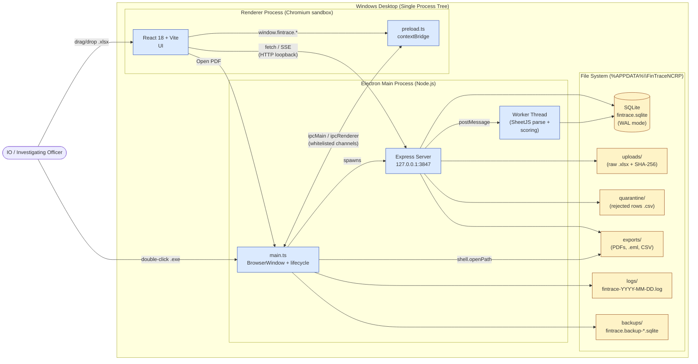
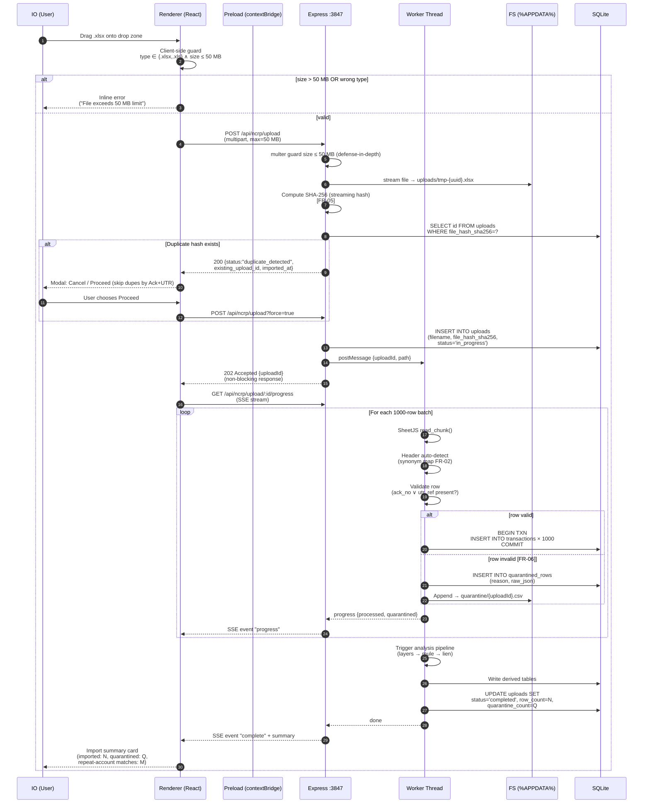
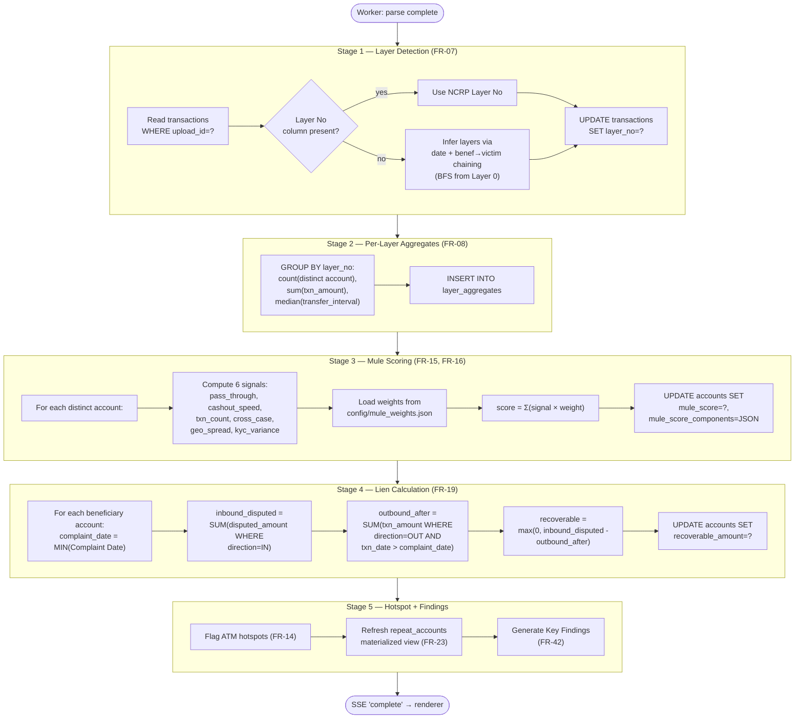
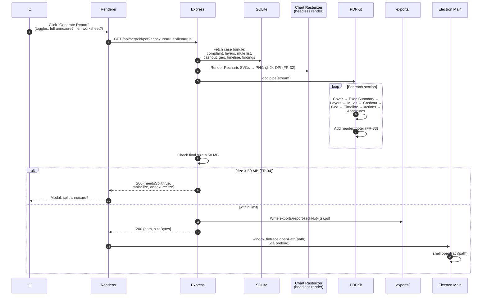
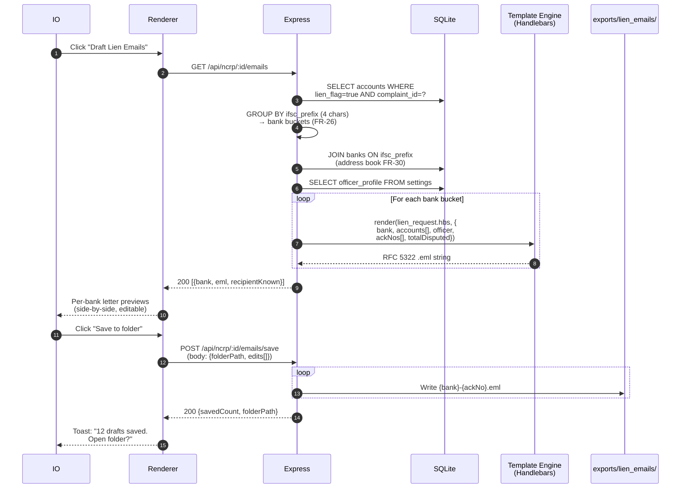

# System Design Document (SDD)
## FinTrace NCRP — Cyber Crime Financial Trail Analyzer

| Field | Value |
|---|---|
| Document ID | FINTRACE-SDD-001 |
| Version | 1.0 |
| Status | Baseline |
| Date | 2026-05-26 |
| Owner | Architecture / Engineering |
| Related | FINTRACE-SRS-001 (v1.0) |
| Audience | Engineering, QA, Tech Leads |

> **Design override note:** Although `FR-01` in the SRS quotes 250 MB as the rejection threshold, this SDD treats **50 MB as the enforced upload size limit** at every system boundary (drag-drop validator, multipart parser, IPC bridge, Express middleware). This is the binding constraint for implementation.

---

## 1. Component Architecture

FinTrace NCRP is a single-binary Electron 28 application with four cooperating runtime components and two on-disk stores. All inter-component traffic stays on the local loopback interface (`127.0.0.1`).

### 1.1 High-Level Component Diagram (Mermaid)



### 1.2 Component Responsibilities

| Component | Responsibility | Why this boundary |
|---|---|---|
| **Electron Main** | App lifecycle, window creation, menu, native dialogs, log rotation, daily backup, spawning Express + worker. | Only the main process has full Node privileges; UI sandbox must not. |
| **Renderer (React/Vite)** | Presentation, charts, tables, user input. No filesystem, no Node APIs. | Hardened with `contextIsolation: true`, `nodeIntegration: false`. |
| **Preload (`preload.ts`)** | Narrow typed IPC surface (`window.fintrace.openExternal`, `window.fintrace.savePdfDialog`, `window.fintrace.onProgress`). Whitelisted channels only. | Bridges renderer ↔ main without leaking `ipcRenderer` itself. |
| **Express Server** | REST + Server-Sent-Events for progress. Owns business logic: parsing, scoring, lien math, PDF/email generation. Bound to `127.0.0.1:3847`. | Renderer talks to it over `fetch` exactly as if it were a remote API — keeps logic process-isolated and unit-testable. |
| **Worker Thread** | CPU-bound work: SheetJS parsing, mule scoring on 10k+ accounts. | Avoids blocking Express event loop; renderer stays at 60 fps during 50k-row imports (NFR-03). |
| **SQLite (better-sqlite3)** | All durable case state (WAL mode, `synchronous=NORMAL`). | Single-file, zero-admin, transactionally safe. |
| **File System** | Raw uploads (kept for re-parse / audit), quarantined-row CSVs, exports, logs, backups. | All under `%APPDATA%\FinTraceNCRP\` — per-user, not world-readable. |

---

## 2. Data Flow Diagrams

### 2.1 File Upload Flow (drag-drop → DB insert → analysis trigger)

Highlights the **SHA-256 dedupe step (FR-05)**, the **50 MB enforced limit**, and the **quarantine branch (FR-06)**.



**Critical guarantees**

- Step 4 (size guard) is enforced in **three places**: HTML5 `<input accept>` hint, renderer JS validator, Express `multer` middleware. Renderer rejection short-circuits the network round-trip; Express rejection is the binding one.
- SHA-256 is computed **streaming** (Node `crypto.createHash('sha256')`) — never load the whole 50 MB into memory.
- Quarantined rows go to **both** the DB (`quarantined_rows`) and a sibling CSV in `quarantine/{uploadId}.csv` so the IO can fix them in Excel and re-import.
- The HTTP response is **202 Accepted** with the `uploadId` — analysis runs async; progress streams over SSE. This satisfies NFR-03 (UI never blocks).

### 2.2 Analysis Flow (raw txns → layers → mule scoring → lien)



Each stage runs inside its own `db.transaction(...)` to keep partial failures recoverable.

### 2.3 PDF Report Flow



### 2.4 Email Generation Flow (Lien Letters)



---

## 3. API Contract

All endpoints are served by Express on `http://127.0.0.1:3847`. Content-Type is `application/json` unless stated. Errors follow a uniform envelope (see §3.16).

### 3.1 `POST /api/ncrp/upload`

Upload an NCRP Excel file. Triggers async parse + analysis; returns immediately with an upload id.

**Request (multipart/form-data):**

| Field | Type | Required | Notes |
|---|---|---|---|
| `file` | `File` | Yes | `.xlsx` or `.xls`, **≤ 50 MB** (enforced) |
| `force` | `boolean` (query) | No | If `true`, bypasses duplicate-hash check. |

**Success — 202 Accepted:**

```ts
{
  uploadId: number;
  status: "in_progress";
  fileHashSha256: string;     // 64 hex chars
  filename: string;
  sizeBytes: number;
  progressStreamUrl: string;  // e.g. "/api/ncrp/upload/42/progress"
}
```

**Duplicate detected — 200 OK:**

```ts
{
  status: "duplicate_detected";
  existingUploadId: number;
  importedAt: string;         // ISO-8601
  fileHashSha256: string;
}
```

**Errors:**
- `400 INVALID_FILE_TYPE` — extension not `.xlsx`/`.xls`.
- `413 FILE_TOO_LARGE` — size > 50 MB.
- `500 STORAGE_FAILED` — disk write failed.

### 3.2 `GET /api/ncrp/upload/:id/progress`

Server-Sent-Events stream of import progress.

**Path params:** `id: number` (uploadId).
**Response:** `text/event-stream`. Events:

```
event: progress
data: {"processed": 12000, "total": 53210, "quarantined": 14}

event: complete
data: {"imported": 52890, "quarantined": 320, "repeatMatches": 7,
       "complaintIds": [101, 102]}

event: error
data: {"code": "PARSE_FAILED", "message": "..."}
```

### 3.3 `GET /api/ncrp/reports`

List all uploads (a.k.a. "reports") with summary stats. Used by S-04 Upload History.

**Query params:**

| Param | Type | Default | Notes |
|---|---|---|---|
| `status` | `"completed" \| "failed" \| "in_progress"` | (all) | |
| `from` | `string` (ISO date) | — | |
| `to` | `string` (ISO date) | — | |
| `limit` | `number` | 50 | Max 200 |
| `offset` | `number` | 0 | |

**Success — 200 OK:**

```ts
{
  items: Array<{
    uploadId: number;
    filename: string;
    fileHashSha256: string;
    rowCount: number;
    quarantineCount: number;
    complaintCount: number;
    status: "completed" | "failed" | "in_progress";
    errorMessage: string | null;
    uploadedAt: string;       // ISO-8601
  }>;
  total: number;
}
```

### 3.4 `GET /api/ncrp/:id`

Per-complaint dashboard payload (S-05).

**Path params:** `id: number` (complaintId).

**Success — 200 OK:**

```ts
{
  complaint: {
    id: number;
    ackNo: string;
    complaintDate: string;       // ISO-8601 IST
    victim: { accountNo: string | null; bank: string | null };
    totals: {
      txnCount: number;
      totalAmount: number;       // INR
      disputedAmount: number;
      distinctAccounts: number;
      distinctBanks: number;
    };
  };
  keyFindings: Array<{
    id: number;
    severity: "INFO" | "WATCH" | "ACTION";
    message: string;
    linkedScreen: string | null; // e.g. "mules", "lien"
    state: "new" | "acknowledged" | "acted_on" | "dismissed";
  }>;
}
```

**Errors:** `404 COMPLAINT_NOT_FOUND`.

### 3.5 `GET /api/ncrp/:id/transactions`

Paginated, filterable transaction list (S-13).

**Query params:**

| Param | Type | Notes |
|---|---|---|
| `layer` | `number` | exact match |
| `bank` | `string` | substring, case-insensitive |
| `dateFrom` / `dateTo` | `string` (ISO date) | |
| `amountMin` / `amountMax` | `number` | INR |
| `paymentMode` | `string` | UPI/IMPS/etc. |
| `city` / `state` | `string` | |
| `muleScoreMin` | `number` | 0–100 |
| `cashoutFlag` | `boolean` | |
| `sortBy` | `"txn_date" \| "amount" \| "mule_score"` | |
| `sortDir` | `"asc" \| "desc"` | default `desc` |
| `limit` | `number` | default 100, **max 500** |
| `offset` | `number` | default 0 |

**Success — 200 OK:**

```ts
{
  items: Array<{
    txnId: number;
    ackNo: string;
    txnDate: string;
    layerNo: number | null;
    beneficiaryAccountNo: string;
    beneficiaryBank: string | null;
    ifscCode: string | null;
    txnAmount: number;
    disputedAmount: number | null;
    paymentMode: string | null;
    city: string | null;
    state: string | null;
    sameDayCashout: boolean;
    cashoutMode: string | null;
    muleScore: number | null;
  }>;
  total: number;
  page: { limit: number; offset: number };
}
```

### 3.6 `GET /api/ncrp/:id/layers`

Layer aggregates + edges for Sankey rendering (S-06).

**Success — 200 OK:**

```ts
{
  layers: Array<{
    layerNo: number;
    distinctAccounts: number;
    totalAmount: number;
    disputedShare: number;       // 0..1
    medianIntervalMinutes: number | null;
  }>;
  edges: Array<{
    fromLayer: number;
    toLayer: number;
    amount: number;
    txnCount: number;
  }>;
}
```

### 3.7 `GET /api/ncrp/:id/mules`

Suspect accounts list (S-08).

**Query params:** `threshold: number` (default 60), `limit: number` (default 50).

**Success — 200 OK:**

```ts
{
  items: Array<{
    accountId: number;
    accountNo: string;
    bank: string | null;
    ifscCode: string | null;
    muleScore: number;
    components: {
      passThrough: { value: number; max: number };
      cashoutSpeed: { value: number; max: number };
      txnCount: { value: number; max: number };
      crossCase: { value: number; max: number };
      geoSpread: { value: number; max: number };
      kycVariance: { value: number; max: number };
    };
    linkedComplaintAckNos: string[];
    tag: "confirmed_mule" | "cleared" | "under_review" | null;
  }>;
  threshold: number;
  total: number;
}
```

### 3.8 `GET /api/ncrp/:id/lien`

Lien worksheet for a complaint (S-09).

**Success — 200 OK:**

```ts
{
  items: Array<{
    accountId: number;
    accountNo: string;
    bank: string | null;
    ifscCode: string | null;
    disputedAmount: number;
    recoverableAmount: number;
    lienStatus: "not_requested" | "pending" | "applied" | "success" | "failed";
    statusAgedDays: number | null;
    complaintAckNos: string[];
    lastUpdated: string | null;
  }>;
  totals: {
    accountCount: number;
    totalRecoverable: number;
    pendingCount: number;
  };
}
```

### 3.9 `POST /api/ncrp/:id/lien`

Update lien status for one or more accounts. All changes are logged in `lien_status_history`.

**Request body:**

```ts
{
  updates: Array<{
    accountId: number;
    newStatus: "not_requested" | "pending" | "applied" | "success" | "failed";
    note?: string;
  }>;
}
```

**Success — 200 OK:**

```ts
{
  updated: number;
  historyIds: number[];
}
```

**Errors:** `400 INVALID_STATUS`, `404 ACCOUNT_NOT_FOUND`.

### 3.10 `GET /api/ncrp/:id/emails`

Generate per-bank lien letters in memory (no disk write).

**Query params:** `force: boolean` (regenerate ignoring cache).

**Success — 200 OK:**

```ts
{
  letters: Array<{
    bankCode: string;            // first 4 chars of IFSC
    bankName: string;
    recipientEmail: string | null;
    recipientKnown: boolean;
    accountCount: number;
    totalDisputed: number;
    emlPreview: string;          // RFC 5322 .eml content
    subject: string;
  }>;
  officerProfile: {
    name: string;
    rank: string;
    posting: string;
  };
}
```

**Errors:** `409 OFFICER_PROFILE_MISSING` — first-run wizard not completed.

### 3.11 `POST /api/ncrp/:id/emails/save`

Persist edited letters as `.eml` files to disk.

**Request body:**

```ts
{
  folderPath: string;            // absolute path on local FS
  letters: Array<{
    bankCode: string;
    emlContent: string;          // may be user-edited
  }>;
}
```

**Success — 200 OK:**

```ts
{ savedCount: number; folderPath: string; files: string[]; }
```

**Errors:** `400 INVALID_FOLDER`, `403 FOLDER_NOT_WRITABLE`.

### 3.12 `GET /api/ncrp/:id/pdf`

Generate and persist the investigation PDF (S-12).

**Query params:**

| Param | Type | Default | Notes |
|---|---|---|---|
| `annexure` | `boolean` | `false` | Include full transaction annexure. |
| `lien` | `boolean` | `true` | Include lien worksheet. |
| `caseNotes` | `string` | `""` | Free-text appended to cover. |

**Success — 200 OK:**

```ts
{
  path: string;                  // absolute path inside exports/
  sizeBytes: number;
  pageCount: number;
  splitRequired: false;
}
```

**Split required — 200 OK (FR-34):**

```ts
{
  splitRequired: true;
  estimatedSizeBytes: number;
  suggestion: "Split annexure into separate file?";
}
```

**Errors:** `409 OFFICER_PROFILE_MISSING`, `500 PDF_GENERATION_FAILED`.

### 3.13 `GET /api/ncrp/:id/timeline`

Daily money movement for S-14.

**Query params:** `from?: string`, `to?: string` (ISO date).

**Success — 200 OK:**

```ts
{
  buckets: Array<{
    date: string;                // YYYY-MM-DD IST
    inboundAmount: number;
    outboundAmount: number;
    txnCount: number;
  }>;
  annotations: Array<{
    date: string;
    kind: "complaint_registered" | "first_cashout" | "hotspot_event";
    label: string;
  }>;
}
```

### 3.14 `GET /api/ncrp/:id/geography`

Geographic distribution for S-15.

**Success — 200 OK:**

```ts
{
  states: Array<{
    stateCode: string;
    stateName: string;
    txnCount: number;
    totalAmount: number;
    distinctAtms: number;
  }>;
  cities: Array<{
    stateCode: string;
    city: string;
    txnCount: number;
    totalAmount: number;
  }>;
  hotspotAtms: Array<{
    atmId: string;
    location: string | null;
    city: string | null;
    state: string | null;
    txnCount: number;
    complaintCount: number;
  }>;
}
```

### 3.15 `DELETE /api/ncrp/:id`

Delete a complaint and **cascade** its transactions, accounts, derived tables, and quarantined rows. Audit row is left in `uploads` with `status='deleted'`.

**Path params:** `id: number`.

**Success — 200 OK:**

```ts
{
  deleted: {
    complaintId: number;
    transactions: number;
    accounts: number;
    quarantinedRows: number;
  };
}
```

**Errors:** `404 COMPLAINT_NOT_FOUND`, `409 IN_USE_BY_REPORT` if a PDF generation is currently running for this complaint.

### 3.16 `GET /api/health`

Liveness probe used by the renderer at startup to confirm the backend is up.

**Success — 200 OK:**

```ts
{
  status: "ok";
  version: string;               // semver
  uptimeSeconds: number;
  dbPath: string;
  dbWritable: boolean;
  schemaVersion: number;
}
```

### 3.17 Uniform Error Envelope

Every non-2xx response:

```ts
{
  error: {
    code: string;                // e.g. "FILE_TOO_LARGE"
    message: string;             // human-readable, EN-IN
    details?: Record<string, unknown>;
    requestId: string;           // for log correlation
  };
}
```

| HTTP | Code (selection) |
|---|---|
| 400 | `INVALID_FILE_TYPE`, `INVALID_STATUS`, `INVALID_FOLDER`, `VALIDATION_FAILED` |
| 403 | `FOLDER_NOT_WRITABLE` |
| 404 | `COMPLAINT_NOT_FOUND`, `ACCOUNT_NOT_FOUND`, `UPLOAD_NOT_FOUND` |
| 409 | `OFFICER_PROFILE_MISSING`, `IN_USE_BY_REPORT` |
| 413 | `FILE_TOO_LARGE` (>50 MB) |
| 500 | `STORAGE_FAILED`, `PARSE_FAILED`, `PDF_GENERATION_FAILED`, `DB_ERROR` |

---

## 4. Folder Structure

```
fintrace-ncrp/
├── package.json                       # root workspace, electron-builder config
├── electron-builder.yml               # NSIS, code-signing, per-user install
├── tsconfig.base.json                 # shared TS settings (strict)
├── .eslintrc.cjs
│
├── electron/                          # === ELECTRON MAIN PROCESS ===
│   ├── main.ts                        # App entry: BrowserWindow, lifecycle, single-instance lock
│   ├── preload.ts                     # contextBridge — exposes window.fintrace.* (whitelisted only)
│   ├── ipc/
│   │   ├── channels.ts                # CONST whitelist of IPC channel names (typed)
│   │   ├── dialogs.ts                 # ipcMain handlers: save-dialog, open-dialog, open-path
│   │   └── progress.ts                # Forward SSE → renderer for parse progress
│   ├── server-bootstrap.ts            # Spawns Express, waits for /api/health
│   ├── backup.ts                      # Daily DB backup (NFR-09)
│   ├── log-rotator.ts                 # Rolling logs, 14-day retention (NFR-28)
│   ├── menu.ts                        # Application menu (File, View, Help)
│   ├── security/
│   │   ├── csp.ts                     # Session-level CSP header injection
│   │   └── network-guard.ts           # webRequest.onBeforeRequest — block non-loopback (NFR-10)
│   └── types/
│       └── ipc.d.ts                   # Shared IPC payload types
│
├── backend/                           # === EXPRESS BACKEND ===
│   └── src/
│       ├── server.ts                  # Express app factory, binds 127.0.0.1:3847 only
│       ├── routes/
│       │   ├── upload.ts              # POST /api/ncrp/upload + SSE progress
│       │   ├── reports.ts             # GET /api/ncrp/reports
│       │   ├── complaint.ts           # GET /api/ncrp/:id
│       │   ├── transactions.ts        # GET /api/ncrp/:id/transactions
│       │   ├── layers.ts              # GET /api/ncrp/:id/layers
│       │   ├── mules.ts               # GET /api/ncrp/:id/mules
│       │   ├── lien.ts                # GET + POST /api/ncrp/:id/lien
│       │   ├── emails.ts              # GET /api/ncrp/:id/emails + POST .../emails/save
│       │   ├── pdf.ts                 # GET /api/ncrp/:id/pdf
│       │   ├── timeline.ts            # GET /api/ncrp/:id/timeline
│       │   ├── geography.ts           # GET /api/ncrp/:id/geography
│       │   ├── deleteComplaint.ts     # DELETE /api/ncrp/:id
│       │   └── health.ts              # GET /api/health
│       ├── middleware/
│       │   ├── multerConfig.ts        # 50 MB cap, allowed extensions
│       │   ├── errorHandler.ts        # Global error → uniform envelope
│       │   ├── requestId.ts           # crypto.randomUUID per request
│       │   └── logger.ts              # pino, redacts file contents from logs
│       ├── db/
│       │   ├── connection.ts          # better-sqlite3 singleton, WAL pragma
│       │   ├── migrations/
│       │   │   ├── 001_initial.sql
│       │   │   ├── 002_findings.sql
│       │   │   └── runner.ts          # idempotent migrator
│       │   ├── schema.ts              # TS types per table
│       │   └── repositories/
│       │       ├── uploads.repo.ts
│       │       ├── complaints.repo.ts
│       │       ├── transactions.repo.ts
│       │       ├── accounts.repo.ts
│       │       ├── lien.repo.ts
│       │       ├── findings.repo.ts
│       │       └── settings.repo.ts
│       ├── ingest/
│       │   ├── worker.ts              # Worker-thread entry — orchestrates parse+analysis
│       │   ├── sheetParser.ts         # SheetJS streaming reader
│       │   ├── headerMap.ts           # Loads + applies header synonyms (FR-02)
│       │   ├── hash.ts                # streaming SHA-256 (FR-05)
│       │   ├── rowValidator.ts        # Quarantine decisions (FR-06)
│       │   └── batchInserter.ts       # 1000-row transactional batches
│       ├── analysis/
│       │   ├── layers.ts              # FR-07, FR-08
│       │   ├── cashout.ts             # FR-11–14
│       │   ├── muleScoring.ts         # FR-15, FR-16
│       │   ├── muleWeights.ts         # Loads config/mule_weights.json
│       │   ├── lien.ts                # FR-19
│       │   ├── findings.ts            # FR-42
│       │   ├── repeatAccounts.ts      # FR-23 materialized view refresh
│       │   └── geography.ts           # FR-45
│       ├── reports/
│       │   ├── pdfBuilder.ts          # PDFKit assembler
│       │   ├── pdfSections/
│       │   │   ├── cover.ts
│       │   │   ├── executiveSummary.ts
│       │   │   ├── layerSection.ts
│       │   │   ├── muleSection.ts
│       │   │   ├── cashoutSection.ts
│       │   │   ├── geographySection.ts
│       │   │   ├── timelineSection.ts
│       │   │   ├── actionsSection.ts
│       │   │   └── annexure.ts
│       │   ├── chartRasterizer.ts     # SVG → PNG @ 2× (FR-32)
│       │   └── pageDecorator.ts       # Header/footer/page numbers (FR-33)
│       ├── emails/
│       │   ├── builder.ts             # Group by bank (FR-26), render Handlebars
│       │   ├── emlWriter.ts           # RFC 5322 serializer
│       │   └── templates/
│       │       └── lien_request.hbs   # Default template (FR-27)
│       ├── config/
│       │   ├── mule_weights.json      # Tunable scoring weights
│       │   ├── header_synonyms.json   # NCRP column variant map
│       │   ├── banks.json             # IFSC prefix → nodal officer
│       │   └── app.ts                 # Port, paths, env
│       ├── utils/
│       │   ├── inrFormat.ts           # 1,23,45,678 formatter (NFR-19)
│       │   ├── dateFormat.ts          # DD-MMM-YYYY HH:mm IST (NFR-20)
│       │   ├── paths.ts               # Resolve %APPDATA%\FinTraceNCRP\
│       │   └── crypto.ts              # SHA-256 helpers
│       └── tests/
│           ├── parser.spec.ts
│           ├── muleScoring.spec.ts
│           └── lien.spec.ts
│
├── frontend/                          # === REACT RENDERER ===
│   ├── vite.config.ts                 # Vite, base="./", build → dist/
│   ├── index.html
│   └── src/
│       ├── main.tsx                   # React root, BrowserRouter
│       ├── App.tsx                    # Top-level routes, ErrorBoundary
│       ├── api/
│       │   ├── client.ts              # fetch wrapper, baseUrl http://127.0.0.1:3847
│       │   ├── upload.ts              # multipart + SSE consumer
│       │   ├── complaints.ts
│       │   ├── transactions.ts
│       │   ├── mules.ts
│       │   ├── lien.ts
│       │   ├── emails.ts
│       │   ├── pdf.ts
│       │   ├── timeline.ts
│       │   └── geography.ts
│       ├── components/
│       │   ├── ErrorBoundary.tsx
│       │   ├── DropZone.tsx           # Drag/drop with size validation
│       │   ├── ProgressBar.tsx
│       │   ├── ConfirmModal.tsx
│       │   ├── VirtualTable.tsx       # TanStack Table v8 + virtualization
│       │   ├── SankeyChart.tsx
│       │   ├── IndiaMap.tsx           # Bundled SVG choropleth
│       │   ├── ScoreBreakdown.tsx     # Mule explainability panel
│       │   └── ...
│       ├── screens/
│       │   ├── SetupWizard.tsx        # S-01
│       │   ├── Dashboard.tsx          # S-02
│       │   ├── Upload.tsx             # S-03
│       │   ├── UploadHistory.tsx      # S-04
│       │   ├── ComplaintDashboard.tsx # S-05
│       │   ├── LayerAnalysis.tsx      # S-06
│       │   ├── Cashout.tsx            # S-07
│       │   ├── SuspectAccounts.tsx    # S-08
│       │   ├── LienTracker.tsx        # S-09
│       │   ├── RepeatAccounts.tsx     # S-10
│       │   ├── DraftEmails.tsx        # S-11
│       │   ├── PdfPreview.tsx         # S-12
│       │   ├── TransactionBrowser.tsx # S-13
│       │   ├── TimelineView.tsx       # S-14
│       │   ├── GeographyView.tsx      # S-15
│       │   ├── KeyFindings.tsx        # S-16
│       │   ├── TemplatesEditor.tsx    # S-17
│       │   ├── BankAddressBook.tsx    # S-18
│       │   ├── OfficerProfile.tsx     # S-19
│       │   ├── Settings.tsx           # S-20
│       │   └── About.tsx              # S-21
│       ├── state/
│       │   ├── store.ts               # Zustand (lightweight)
│       │   ├── crossFilter.ts         # FR-40 brush propagation
│       │   └── savedViews.ts          # FR-37
│       ├── hooks/
│       │   ├── useSSE.ts              # Progress stream consumer
│       │   ├── useDebounced.ts
│       │   └── usePagination.ts
│       ├── i18n/
│       │   └── en-IN.json
│       ├── theme/
│       │   ├── tokens.ts              # WCAG-AA palette
│       │   └── global.css
│       └── types/
│           ├── api.d.ts               # Mirrors §3 response shapes
│           └── fintrace.d.ts          # window.fintrace IPC surface
│
└── docs/
    ├── SRS.md
    ├── SDD.md                          # ← this document
    └── architecture-diagrams/
```

---

## 5. Electron Security Design

The threat model treats the renderer as the **least-trusted** component: it parses HTML, runs `<svg>`, displays user-controlled strings, and renders Excel-derived data. Every privileged operation must be brokered.

### 5.1 BrowserWindow Hardening

```ts
// electron/main.ts (excerpt)
const win = new BrowserWindow({
  width: 1400,
  height: 900,
  webPreferences: {
    contextIsolation: true,          // [NFR-12] hard isolation
    nodeIntegration: false,          // [NFR-12] no require() in renderer
    nodeIntegrationInWorker: false,
    nodeIntegrationInSubFrames: false,
    sandbox: true,                   // V8 sandbox + OS sandbox
    webSecurity: true,
    allowRunningInsecureContent: false,
    preload: path.join(__dirname, 'preload.js'),
    spellcheck: false,
  },
});
win.webContents.setWindowOpenHandler(() => ({ action: 'deny' })); // no new windows
win.webContents.on('will-navigate', (e, url) => {
  if (!url.startsWith('http://127.0.0.1:3847/')) e.preventDefault();
});
```

### 5.2 Preload — Whitelisted IPC Surface

The preload exposes **only** these channels — anything else is unreachable from the renderer.

```ts
// electron/preload.ts
import { contextBridge, ipcRenderer } from 'electron';

const ALLOWED_INVOKE = [
  'dialog:saveFile',        // returns user-picked path
  'dialog:chooseFolder',
  'shell:openPath',         // opens PDF/folder in OS handler
  'app:getVersion',
] as const;

const ALLOWED_ON = [
  'parse:progress',         // streamed from main → renderer
  'backup:complete',
] as const;

contextBridge.exposeInMainWorld('fintrace', {
  saveFileDialog: (opts: SaveDialogOpts) =>
    ipcRenderer.invoke('dialog:saveFile', opts),
  chooseFolder: () =>
    ipcRenderer.invoke('dialog:chooseFolder'),
  openPath: (absPath: string) =>
    ipcRenderer.invoke('shell:openPath', absPath),
  getVersion: () =>
    ipcRenderer.invoke('app:getVersion'),
  onParseProgress: (cb: (p: ProgressPayload) => void) => {
    const handler = (_e: unknown, p: ProgressPayload) => cb(p);
    ipcRenderer.on('parse:progress', handler);
    return () => ipcRenderer.removeListener('parse:progress', handler);
  },
});
```

`ipcMain.handle` is registered **only** for the channels above; unknown channels throw.

### 5.3 Content Security Policy

CSP is set as an HTTP header by the main process via `session.webRequest.onHeadersReceived` — defense-in-depth over a `<meta>` tag.

```
Content-Security-Policy:
  default-src 'self' http://127.0.0.1:3847;
  script-src  'self';
  style-src   'self' 'unsafe-inline';   /* required for emotion/CSS-in-JS */
  img-src     'self' data: blob:;
  font-src    'self' data:;
  connect-src 'self' http://127.0.0.1:3847;
  object-src  'none';
  frame-ancestors 'none';
  base-uri 'self';
  form-action 'none';
```

### 5.4 Network Egress Block (NFR-10)

```ts
// electron/security/network-guard.ts
session.defaultSession.webRequest.onBeforeRequest((details, cb) => {
  const url = new URL(details.url);
  const allowed = url.hostname === '127.0.0.1' || url.hostname === 'localhost'
                  || url.protocol === 'file:' || url.protocol === 'data:';
  cb({ cancel: !allowed });
});
```

Express also binds explicitly: `app.listen(3847, '127.0.0.1')` — never `0.0.0.0`.

### 5.5 Additional Safeguards

- **Single-instance lock** (`app.requestSingleInstanceLock`) — prevents two processes racing on the same SQLite file.
- **`app.enableSandbox()`** — applies OS sandbox to all renderers.
- **Disable remote module** — `enableRemoteModule` defaults off in Electron 28; we never re-enable it.
- **Auto-updater disabled** (C-08) — `autoUpdater` is never instantiated.
- **DevTools** — disabled in packaged builds (`win.webContents.openDevTools` only called when `process.env.NODE_ENV === 'development'`).

---

## 6. Performance Design Decisions

### 6.1 Handling 50,000-Row Excel Without UI Freeze

| Concern | Mechanism |
|---|---|
| **Where the work runs** | A dedicated **Node worker thread** (`backend/src/ingest/worker.ts`) — not the Express event loop, not the renderer. The Express handler returns `202 Accepted` immediately after `worker.postMessage({uploadId, path})`. |
| **Streaming parse** | SheetJS in `dense` mode with `read` configured to iterate sheet rows lazily; we never `JSON.stringify` the whole workbook. |
| **Renderer feedback** | Progress events at ≥ 10 Hz via SSE → state update batched with `requestAnimationFrame`. |
| **Memory ceiling** | Working set capped: each 1000-row batch is parsed → inserted → released before reading the next. Peak heap during a 50k import stays under 200 MB (well within C-03's 1 GB target). |
| **CPU yielding** | Between batches, `setImmediate(() => continueParsing())` to keep the libuv loop responsive for SSE flushes. |

### 6.2 Batch Insert Strategy for SQLite

`better-sqlite3` is synchronous, so the perf trick is **prepared statements inside a single transaction**, batched in 1000-row windows.

```ts
const insert = db.prepare(`
  INSERT INTO transactions (
    complaint_id, ack_no, txn_date, beneficiary_account_no,
    beneficiary_bank, ifsc_code, txn_amount, disputed_amount,
    payment_mode, layer_no, atm_id, city, state, remarks,
    source_upload_id
  ) VALUES (
    @complaint_id, @ack_no, @txn_date, @beneficiary_account_no,
    @beneficiary_bank, @ifsc_code, @txn_amount, @disputed_amount,
    @payment_mode, @layer_no, @atm_id, @city, @state, @remarks,
    @source_upload_id
  )
`);

const insertMany = db.transaction((rows: TxnRow[]) => {
  for (const row of rows) insert.run(row);
});

// caller:
for (const batch of chunks(parsedRows, 1000)) insertMany(batch);
```

**Why 1000:** below ~200, the per-transaction WAL fsync dominates; above ~5000, a parse error or memory spike rolls back too much work. 1000 is the empirical sweet spot for the target hardware. WAL mode + `PRAGMA synchronous=NORMAL` (NFR-07) gives ~10× throughput over the default `FULL` while keeping crash safety acceptable for a single-user tool.

### 6.3 Why Analysis Runs Async

`POST /api/ncrp/upload` returns `202 Accepted` *before* layer/mule/lien analysis runs. Two reasons:

1. **Bounded HTTP latency:** A 50k-row file plus full analysis can take 30–60s on i3/HDD. Holding the HTTP socket that long invites browser/proxy timeouts and gives the renderer no opportunity to display progress.
2. **Independent cancellation surface:** SSE progress stream is a separate connection — the renderer can navigate away, the parse keeps going, and the user comes back to a completed import.

The renderer keys analysis state off the upload row's `status` column; the SSE `complete` event causes the UI to refetch the dashboard.

### 6.4 Pagination Strategy for Transaction Table

The 50k-row Transaction Browser uses **two layers of laziness**:

- **Server side — keyset pagination** with `limit`/`offset` capped at 500 rows per request. The endpoint accepts filters and a `sortBy`/`sortDir` so the server pushes filtering into SQLite indexes:

  ```sql
  CREATE INDEX idx_txn_complaint_date ON transactions(complaint_id, txn_date DESC);
  CREATE INDEX idx_txn_layer        ON transactions(complaint_id, layer_no);
  CREATE INDEX idx_txn_account      ON transactions(beneficiary_account_no, ifsc_code);
  CREATE INDEX idx_txn_amount       ON transactions(complaint_id, txn_amount);
  ```

- **Client side — windowed rendering** via TanStack Table + `@tanstack/react-virtual`. Only ~30 DOM rows exist at any time; scrolling fetches the next 500-row window with a 200 ms debounce. This is what makes FR-36's 60 fps achievable.

Filter mutations reset the offset to 0 and discard previous windows — predictable memory profile, no zombie pages.

### 6.5 Other Notable Choices

- **PDF chart rasterization** runs on the same worker thread as analysis, then is handed to PDFKit in the main Express handler — keeps the long-running PDF generation off the SQLite write path.
- **Repeat-account view** is a real `accounts_repeat` table refreshed on each successful upload (write amplification is fine; reads are vastly more frequent). Avoids a recursive cross-complaint join on every Dashboard load.

---

## 7. Error Handling Strategy

### 7.1 Express Global Error Handler

A single error-handling middleware terminates every route. Async handlers are wrapped in an `asyncHandler` utility so thrown exceptions reach it.

```ts
// backend/src/middleware/errorHandler.ts
export function errorHandler(
  err: AppError | Error,
  req: Request, res: Response, _next: NextFunction
) {
  const requestId = req.requestId;
  const isKnown = err instanceof AppError;
  const status = isKnown ? err.status : 500;
  const code   = isKnown ? err.code   : 'INTERNAL_ERROR';

  logger.error({ requestId, code, err }, 'Request failed');

  res.status(status).json({
    error: {
      code,
      message: isKnown ? err.message : 'An unexpected error occurred.',
      details: isKnown ? err.details : undefined,
      requestId,
    },
  });
}
```

`AppError` is a typed throwable with `status`, `code`, `details`. Routes throw `new AppError(413, 'FILE_TOO_LARGE', '...')` instead of writing to `res` directly.

A process-level safety net catches anything that escapes Express:

```ts
process.on('unhandledRejection', (reason) =>
  logger.fatal({ reason }, 'unhandledRejection'));
process.on('uncaughtException', (err) => {
  logger.fatal({ err }, 'uncaughtException');
  // Do NOT exit — Electron main supervises us; let it decide.
});
```

### 7.2 Frontend Error Boundaries

The React tree is wrapped at two levels:

1. **Top-level** boundary in `App.tsx` — full-app fallback ("Something went wrong. Restart FinTrace.") with a button that triggers `window.location.reload()`.
2. **Per-screen** boundaries around heavy screens (Layer Sankey, Timeline brush, India choropleth) — a screen-local fallback keeps the rest of the app navigable.

```tsx
// frontend/src/components/ErrorBoundary.tsx
class ErrorBoundary extends React.Component<Props, State> {
  state = { error: null as Error | null };
  static getDerivedStateFromError(error: Error) { return { error }; }
  componentDidCatch(error: Error, info: React.ErrorInfo) {
    // No network log — write to local Electron log via preload.
    window.fintrace.logError?.({ error: error.message, stack: error.stack, info });
  }
  render() {
    if (this.state.error) return this.props.fallback(this.state.error);
    return this.props.children;
  }
}
```

API failures don't throw into render — `api/client.ts` returns a discriminated `Result<T, ApiError>`. Screens render an inline error state with a Retry button rather than unmounting.

### 7.3 SQLite Transaction Rollback

Every multi-step DB operation uses `db.transaction(...)` from `better-sqlite3`, which:

- Begins a deferred transaction,
- Re-throws any error from the inner function **after** issuing `ROLLBACK`,
- Commits only on clean return.

Specifically, **a single batch's failure rolls back that batch only**, not the whole upload. The worker catches the error, marks those 1000 rows as quarantined (with reason `INSERT_FAILED`), and continues. This is what makes a 50k-row import resilient to one malformed row.

For the upload as a whole — if the worker crashes mid-run — UC-11's recovery path applies: on next launch, `connection.ts` runs:

```sql
UPDATE uploads
   SET status = 'failed', error_message = 'Aborted before completion'
 WHERE status = 'in_progress';

DELETE FROM transactions
 WHERE source_upload_id IN (
   SELECT id FROM uploads WHERE status = 'failed'
                            AND completed_at IS NULL
 );
```

…inside a single transaction, satisfying NFR-08 (all-or-nothing per upload).

### 7.4 Electron Crash Recovery

Three failure modes, three responses:

| Failure | Detection | Response |
|---|---|---|
| **Renderer crash** (`render-process-gone`) | `webContents.on('render-process-gone', ...)` | Log reason; if `reason !== 'clean-exit'`, reload the renderer once; if it crashes again within 30 s, show native dialog with "Restart / Quit". |
| **Express subprocess exit** | Express runs in-process, but the worker thread can die; main listens for `worker.on('exit', code)` | Mark in-progress uploads as failed (see §7.3 recovery SQL); show toast in UI "Background task ended unexpectedly". |
| **GPU/Window crash** | `app.on('gpu-process-crashed', ...)` | Single auto-restart with `app.relaunch(); app.exit(0);`. |

**Boot self-check** runs every launch:

1. Open SQLite — if `SQLITE_CORRUPT`, copy `fintrace.sqlite` → `fintrace.corrupt-<ts>.sqlite`, restore from newest backup in `backups/` (NFR-09), surface a non-dismissible notice.
2. Run the orphaned-upload recovery SQL from §7.3.
3. Verify schema version against the migration runner; apply pending migrations forward-only (C-09).
4. `GET /api/health` from the renderer before showing the Dashboard — fail-stop with retry if backend hasn't bound `127.0.0.1:3847` within 5 s.

### 7.5 User-Visible Error Surfaces

| Layer | Surface |
|---|---|
| Drag-drop validation | Inline red banner on DropZone (no modal). |
| Upload size / type | `413` from server → toast + DropZone error. |
| Parse partial failure | Import summary card lists `<imported>/<quarantined>` with link to export quarantined CSV (FR-06). |
| Analysis failure | Banner on per-complaint dashboard; "Re-run analysis" button (calls a `POST /api/ncrp/:id/reanalyze` — out of scope for v1 but reserved in the API namespace). |
| PDF size > 50 MB | Modal (FR-34) — split annexure or cancel. |
| Officer profile missing on lien/PDF | `409 OFFICER_PROFILE_MISSING` → modal that opens S-19 Officer Profile inline. |

---

*End of SDD v1.0 — FinTrace NCRP*
